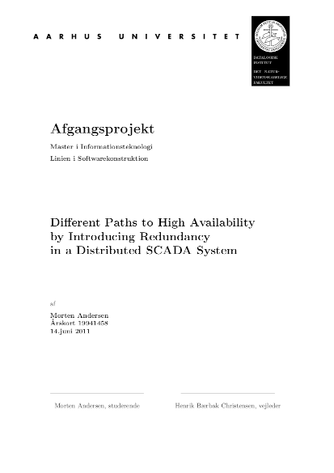
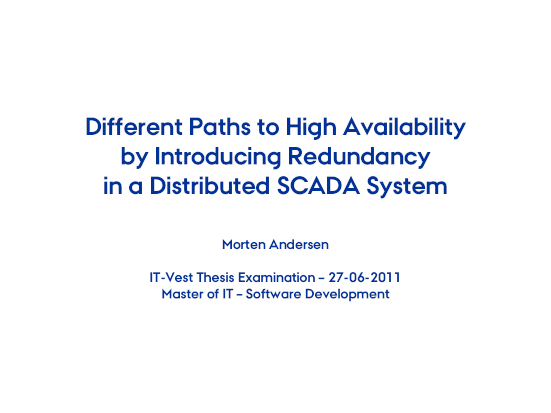
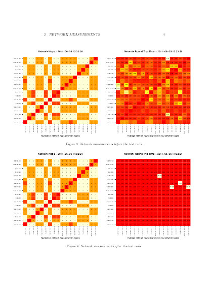
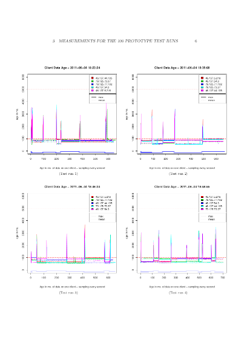

## Thesis for **Master of Information Technology, Software Development**

*Different Paths to High Availability by Introducing Redundancy in a Distributed SCADA System* - June 14, 2011

### Abstract

This thesis documents the architectural theory in adding new high availability requirements to an existing highly distributed Java based wind farm Supervisory Control and Data Acquisition (SCADA) system. A soft real-time system with an architecture that was originally designed with performance as the main architectural driver.

Based on the theory three different prototypes have been build, each using a different path to reach the same goal. One using an active redundancy tactic with network multicast, one using passive redundancy using distributed shared memory (DSM) and finally one prototype build upon the end-to-end principle.

To test how the three prototypes performs when applied to the SCADA system, a test bench using virtual machines has been build running on the Amazon Elastic Compute Cloud (EC2) computing platform. This test bench made it possible to evaluate the three prototypes in a realistic way running on a distributed system with 18 nodes without a big hardware setup.

The tests revealed that the DSM based prototype failed in fulfilling the new requirements. The prototype based on network multicasts was almost successful, with some minor bugs that will need additional work. Finally the end-to-end based prototype was very successful in adding the new availability requirements

### Thesis Defense

### Source Code

* [Source Code](./source)

### Appendices

